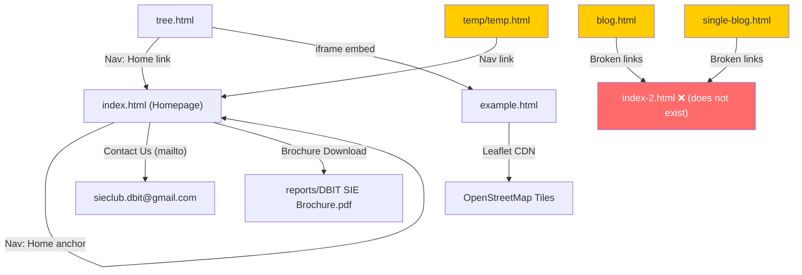

# DBIT SIE Club Website — Complete Codebase Analysis Report

---

## 1. Overall Website Architecture

This is a **fully static website** built on a pre-made HTML template called **"Digitalo" (by Templates Hub)** — an SEO/Digital Marketing template that has been adapted for the **DBIT SIE (Social Innovation for Environment) Club** at Don Bosco Institute of Technology, Mumbai.

The site is hosted via **GitHub Pages** with a custom domain (`sevatech.dbit.in` — configured in the [CNAME](file:///c:/Users/Prashant%20Ashok%20Ghuge/SIE_DBIT_website/CNAME) file).

**Tech Stack:**
- HTML5
- CSS3 (vanilla + Bootstrap 3.x grid)
- jQuery 1.12.4 + jQuery plugins
- No build system, no server-side code

**Architecture Pattern:** Multi-page static site with the homepage being a single-page-app-like scrolling layout (all sections on one page, anchored by `#id` links).

---

## 2. List of All Pages

| # | File | Purpose | Status |
|---|------|---------|--------|
| 1 | [index.html](file:///c:/Users/Prashant%20Ashok%20Ghuge/SIE_DBIT_website/index.html) | **Main Homepage** — the primary public-facing page | ✅ Active |
| 2 | [tree.html](file:///c:/Users/Prashant%20Ashok%20Ghuge/SIE_DBIT_website/tree.html) | **Tree Mapping** — embeds a Leaflet.js map of DBIT campus trees | ✅ Active (secondary page) |
| 3 | [example.html](file:///c:/Users/Prashant%20Ashok%20Ghuge/SIE_DBIT_website/example.html) | **Leaflet Map** — standalone map page embedded as an iframe inside `tree.html` | ✅ Active (embedded) |
| 4 | [blog.html](file:///c:/Users/Prashant%20Ashok%20Ghuge/SIE_DBIT_website/blog.html) | Blog listing page | ⚠️ Template leftover — not linked from homepage nav |
| 5 | [single-blog.html](file:///c:/Users/Prashant%20Ashok%20Ghuge/SIE_DBIT_website/single-blog.html) | Single blog post detail page | ⚠️ Template leftover — not linked from homepage nav |
| 6 | [temp/temp.html](file:///c:/Users/Prashant%20Ashok%20Ghuge/SIE_DBIT_website/temp/temp.html) | **Team page** for a previous iteration ("DBIT SevaTech") | ⚠️ Legacy/abandoned file |

---

## 3. Purpose of Each Page (Detailed)

### 3.1 [index.html](file:///c:/Users/Prashant%20Ashok%20Ghuge/SIE_DBIT_website/index.html) — Main Homepage (1022 lines)
The single-scroll homepage for DBIT SIE Club. Sections (top to bottom):

| Section | ID/Class | Description |
|---------|----------|-------------|
| Preloader | `.preeloader` | Loading spinner animation |
| Scroll to Top | `.scrolltotop` | Fixed button, appears on scroll |
| Navbar | `.mainmenu-area` | Sticky navbar with "SIE CLUB" text logo; links to `#home` and `#team` only (other nav items commented out) |
| Hero/Welcome | `#home` `.welcome-text-area` | Hero section with DBIT logo, tagline, and a decorative mockup image on the right |
| Our Mission | `#features` | 3 mission statement cards with icon images |
| ~~Report Area~~ | commented out | Old SEO form — fully commented out |
| About Us | `#about` | About the club with a "Contact Us" mailto link and an about image |
| Ambitions | `.testimonials-style-five` | Owl Carousel slider showing 3 ambition quotes with navigation arrows |
| ~~Pricing~~ | commented out | Template pricing table — fully commented out |
| Team — SIE's First Core | `#team` | 8 team members (Chairperson to Documentation Head) in a 4-column grid with photos |
| Team — SIE's Core | (same section) | 11 more team members in a second grid |
| ~~Blog/Projects~~ | commented out | Project cards (YWCA app, Shelter Don Bosco, etc.) — fully commented out |
| Brochure Download | `.report-flex` | PDF download link for "DBIT SIE Brochure.pdf" |
| ~~Client Area~~ | commented out | Client logo slider — fully commented out |
| Footer — Contact Us | `footer` | Phone, email, and address in a 2-column layout |
| Footer — Copyright | `.footer-copyright` | "©2022 DBIT SIE CLUB." |

### 3.2 [tree.html](file:///c:/Users/Prashant%20Ashok%20Ghuge/SIE_DBIT_website/tree.html) — Tree Mapping Page
- Navbar links back to `index.html` (Home) and has a "Tree" active link
- Banner with title "Tree Mapping" and placeholder Lorem ipsum text
- Embeds `example.html` inside an `<iframe>` (600×400)
- Has a **commented-out Junior Team section** (7 members)
- Footer identical to `index.html`

### 3.3 [example.html](file:///c:/Users/Prashant%20Ashok%20Ghuge/SIE_DBIT_website/example.html) — Leaflet Map
- Loads Leaflet.js from **unpkg CDN** (v1.9.1)
- Displays OpenStreetMap tiles centered on DBIT campus coordinates `[19.08170, 72.88911]`
- Renders a single GeoJSON circle marker at the campus location
- References [tree.js](file:///c:/Users/Prashant%20Ashok%20Ghuge/SIE_DBIT_website/tree.js) which is **entirely commented out** (empty code)

### 3.4 [blog.html](file:///c:/Users/Prashant%20Ashok%20Ghuge/SIE_DBIT_website/blog.html) — Blog Listing
- Pure template content — title still says "Digitalo Digital Marketing & SEO Template"
- Contains placeholder blog posts, categories, tag clouds
- Links to `index-2.html` (which **does not exist** in the project)
- Has login/register links (non-functional)
- **Not customized for SIE at all**

### 3.5 [single-blog.html](file:///c:/Users/Prashant%20Ashok%20Ghuge/SIE_DBIT_website/single-blog.html) — Single Blog Post
- Same template placeholder content
- Has a comment section with fake comments
- References `index-2.html` (non-existent)
- **Not customized for SIE at all**

### 3.6 [temp/temp.html](file:///c:/Users/Prashant%20Ashok%20Ghuge/SIE_DBIT_website/temp/temp.html) — Legacy Team Page
- Title: "Team - DBIT SevaTech" (old club name)
- Lists old SevaTech team members (Ruvin Rodrigues, Shawn Louis, Hayden Cordeiro, etc.)
- Has a Junior Team section
- File paths reference `assets/img/team/10.webp`, `11.webp`, etc. — **images that don't exist** in the current `team/` folder

---

## 4. HTML Structure

### Document Pattern (shared across all pages)
```
<!doctype html>
<html lang="en">
<head>
  <!-- Meta tags, Title, Favicon -->
  <!-- CSS: plugins.css → theme.css → icons.css → style.css → responsive.css -->
  <!-- Modernizr -->
</head>
<body class="home-three | single-page" data-spy="scroll" data-target=".mainmenu-area" data-offset="90">
  <!-- Preloader -->
  <!-- Scroll-to-top button -->
  <header>
    <!-- Sticky navbar (StellarNav) -->
    <!-- Hero section or page banner -->
  </header>
  <!-- Content sections -->
  <footer>
    <!-- Contact info + copyright -->
  </footer>
  <!-- jQuery + Plugins + main.js -->
</body>
</html>
```

### Key Observations
- Uses **Bootstrap 3.x** grid system (`col-md-X`, `col-lg-X`, `col-sm-X`, `col-xs-12`)
- `index.html` uses `class="home-three"` (the third variant of the original template)
- Secondary pages use `class="single-page"`
- The navbar is **NOT componentized** — it is copy-pasted across all pages with slight variations
- The footer is also **duplicated** across all pages (not componentized)
- Massive amounts of **commented-out HTML** from the original template (Pricing, Blog, Client Area, Footer widgets)
- Many empty `alt=""` attributes on images

---

## 5. CSS Structure

### CSS Loading Order
1. **[plugins.css](file:///c:/Users/Prashant%20Ashok%20Ghuge/SIE_DBIT_website/assets/css/plugins.css)** → imports:
   - `normalize.css` (browser reset)
   - `animate.css` (WOW.js animations)
   - `owl.carousel.css` (carousel plugin)
   - `swiper.min.css` (swiper plugin)
   - `stellarnav.min.css` (responsive nav)
   - `bootstrap.min.css` (Bootstrap 3 grid + components)

2. **[bx-slider.css](file:///c:/Users/Prashant%20Ashok%20Ghuge/SIE_DBIT_website/assets/css/plugins/bx-slider.css)** (only on `index.html` and `tree.html`)

3. **[theme.css](file:///c:/Users/Prashant%20Ashok%20Ghuge/SIE_DBIT_website/assets/css/theme.css)** → imports 22 core CSS files:
   - `text-typography.css`, `default.css`, `margin.css`, `padding.css`, `background.css`, `color.css`, `border.css`, `shadow.css`, `before-after.css`, `menu.css`, `form-and-input.css`, `area-bg.css`, `area-title.css`, `hover.css`, `home-area.css`, `slider-area.css`, `box.css`, `team.css`, `screenshot.css`, `blog.css`, `widgets.css`, `single-page.css`

4. **[icons.css](file:///c:/Users/Prashant%20Ashok%20Ghuge/SIE_DBIT_website/assets/css/icons.css)** → imports `font-awesome.min.css`

5. **[style.css](file:///c:/Users/Prashant%20Ashok%20Ghuge/SIE_DBIT_website/style.css)** (1539 lines) — the main custom stylesheet containing:
   - Welcome/hero area styling
   - About area
   - Service/feature boxes
   - Client carousel
   - Testimonial area
   - Pricing (unused, template leftover)
   - Blog area
   - Contact area
   - Footer area
   - Scroll-to-top
   - Blog page styles
   - Home Two variant styles (unused)
   - Home Three variant styles (active — used by `index.html`)
   - Report/brochure download area
   - Testimonial style five
   - Team style four
   - Price style three (unused)

6. **[responsive.css](file:///c:/Users/Prashant%20Ashok%20Ghuge/SIE_DBIT_website/assets/css/responsive.css)** (292 lines) — breakpoints:
   - `≥1920px` (large screens)
   - `992px–1200px` (medium)
   - `768px–991px` (tablet)
   - `≤767px` (mobile)
   - `480px–767px` (wide mobile)
   - Also contains the **preloader** animation CSS

### Color Scheme
| Purpose | Color |
|---------|-------|
| Primary accent (buttons, CTA) | `#8ce97a` / `#79ff67` (green) |
| Template accent (leftover) | `#FF7467` (coral red) |
| Secondary accent | `#334d88` (navy blue) |
| Navigation arrows (testimonials) | `#1ba329` (green) |
| Home Two variant (unused) | `#4694f9` (blue) |
| Text/headings | `#2b2b2b` / `#44578E` |
| Background | `#f6f7fa` / `#f3f3f3` |

> [!WARNING]
> There is a **color inconsistency**: The main `.read-more` button uses green (`#8ce97a`), but many template-leftover styles still reference `#FF7467` (coral), and some use `#4694f9` (blue). This creates visual inconsistency if any template features are re-enabled.

---

## 6. JavaScript Functionality

### Library Stack (loaded in this order)
| Library | File | Version | Purpose |
|---------|------|---------|---------|
| Modernizr | `modernizr-2.8.3.min.js` | 2.8.3 | HTML5/CSS3 feature detection |
| jQuery | `jquery-1.12.4.min.js` | **1.12.4** ⚠️ | Core DOM manipulation library |
| Bootstrap JS | `bootstrap.min.js` | 3.x | Bootstrap components (scrollspy, collapse) |
| jQuery Easing | `jquery.easing.1.3.js` | 1.3 | Smooth scroll easing functions |
| jQuery Migrate | `jquery-migrate-1.2.1.min.js` | 1.2.1 | Backward compatibility for deprecated jQuery APIs |
| jQuery Appear | `jquery.appear.js` | — | Detect when elements enter viewport |
| Owl Carousel | `owl.carousel.min.js` | 2.x | Carousel/slider for testimonials, clients |
| Swiper | `swiper.min.js` | — | Alternative slider (loaded but mostly unused) |
| bxSlider | `jquery.bxslider.min.js` | — | Another slider (used for testimonials on index) |
| Parallax Scroll | `jquery.parallax-scroll.js` | — | Parallax scrolling effects |
| Stellar.js | `stellar.js` | — | Another parallax library |
| WOW.js | `wow.min.js` | — | Animate-on-scroll (triggers animate.css) |
| StellarNav | `stellarnav.min.js` | — | Responsive mobile navigation |
| Placeholdem | `placeholdem.min.js` | — | Placeholder text animation |
| jQuery Sticky | `jquery.sticky.js` | — | Sticky navbar on scroll |
| Leaflet | CDN (`unpkg.com/leaflet@1.9.1`) | 1.9.1 | Map rendering (only in `example.html`) |

### Custom JavaScript — [main.js](file:///c:/Users/Prashant%20Ashok%20Ghuge/SIE_DBIT_website/assets/js/main.js) (270 lines)
Initializes all jQuery plugins on `document.ready`:
1. **Sticky navbar** — `$("#mainmenu-area").sticky()`
2. **Smooth scrolling** — Intercepts anchor clicks for smooth scroll with `easeInOutExpo`
3. **Mobile menu** — `$('.stellarnav').stellarNav({ theme: 'dark' })`
4. **Scroll-to-top button** — Shows/hides based on scroll position
5. **Parallax** — `$(window).stellar()`
6. **Client carousel** — Owl Carousel with responsive breakpoints
7. **Testimonial carousel** — Owl Carousel
8. **Price list carousel** — Owl Carousel (unused)
9. **Blog carousel** — Owl Carousel (unused)
10. **Testimonial five style** — Linked Owl Carousels (details + photos synced)
11. **WOW.js initialization** — Triggers animations on scroll
12. **Placeholdem** — Animates placeholders
13. **Preloader fadeout** — On `window.load`

### Inline JavaScript in [index.html](file:///c:/Users/Prashant%20Ashok%20Ghuge/SIE_DBIT_website/index.html#L1002-L1018)
- Initializes a bxSlider for `.testimonials-slider .slider` (though this element doesn't seem to exist in the current HTML, so this code may be non-functional)

### [tree.js](file:///c:/Users/Prashant%20Ashok%20Ghuge/SIE_DBIT_website/tree.js) (12 lines)
- **Entirely commented out** — was meant to define GeoJSON data for tree markers

---

## 7. Assets and Important Files

### Images
| Folder | Content | Count |
|--------|---------|-------|
| `assets/img/team/` | Current SIE team member photos (.webp) | 17 files |
| `assets/img/Junior Team/` | Junior team member photos (.webp) | 7 files |
| `assets/img/blog/` | Blog post images + thumbnails | 12 files |
| `assets/img/home/` | Hero backgrounds, mockups, header images | 15 files + 1 subfolder |
| `assets/img/about/` | About section image | 3 files |
| `assets/img/icon/` | Service/mission icon images (PNG + WebP) | 12 files |
| `assets/img/client/` | Client logo images | 16 files + 1 subfolder |
| `assets/img/testmonial/` | Testimonial author photos | 18 files + 1 subfolder |
| `assets/img/screenshot/` | Contains only an HTML placeholder file | 1 file |
| `assets/img/OldImages/` | Old/original template images (larger file sizes) | 20 files |
| Root (`assets/img/`) | Logos, favicons, backgrounds, project screenshots | 36 files |

### Fonts
- **Font Awesome** (via `assets/fonts/` — 6 webfont files: EOT, SVG, TTF, WOFF, WOFF2)
- **Bootstrap Glyphicons** (via `assets/css/fonts/` — 6 HTML placeholder files; actual font files may be missing)

### Documents
- [DBIT SIE Brochure.pdf](file:///c:/Users/Prashant%20Ashok%20Ghuge/SIE_DBIT_website/reports/DBIT%20SIE%20Brochure.pdf) (~4.8 MB) — Club brochure, downloadable from the homepage

### Configuration Files
- [CNAME](file:///c:/Users/Prashant%20Ashok%20Ghuge/SIE_DBIT_website/CNAME) — Custom domain: `sevatech.dbit.in`
- [.htaccess](file:///c:/Users/Prashant%20Ashok%20Ghuge/SIE_DBIT_website/.htaccess) — Apache config (54KB, though GitHub Pages doesn't use it)
- [.gitattributes](file:///c:/Users/Prashant%20Ashok%20Ghuge/SIE_DBIT_website/.gitattributes) — Git line ending config
- `baseball.png` in root — appears to be a **stray/misplaced file** (81KB PNG in the project root)

---

## 8. External Libraries/Dependencies

| Dependency | Source | Version | Purpose |
|------------|--------|---------|---------|
| jQuery | Local | 1.12.4 | Core library — ⚠️ Very outdated (latest is 3.7.x) |
| jQuery Migrate | Local | 1.2.1 | Deprecated API shim |
| Bootstrap | Local | 3.x | Grid system + components — ⚠️ Outdated (latest is 5.3) |
| Owl Carousel | Local | 2.x | Carousels |
| Swiper | Local | Unknown | Slider (loaded but barely used) |
| bxSlider | Local | Unknown | Testimonial slider |
| WOW.js | Local | Unknown | Scroll animations |
| Animate.css | Local | Unknown | CSS animation library |
| StellarNav | Local | Unknown | Responsive navigation |
| Stellar.js | Local | Unknown | Parallax effects |
| Font Awesome | Local | 4.x | Icon font |
| Modernizr | Local | 2.8.3 | Feature detection |
| Leaflet.js | **CDN** | 1.9.1 | Map (only in example.html) |
| PDF icon SVG | **CDN** | — | `coderthemes.com` (for brochure download icon) |

> [!IMPORTANT]
> **All libraries except Leaflet and the PDF icon are served locally** — no package manager, no npm. The Leaflet CDN is the only external runtime dependency.

---

## 9. How Pages Are Connected



### Navigation Summary
- **`index.html`** — Self-contained single-page scroll (only `#home` and `#team` anchors are active in nav)
- **`tree.html`** — Links back to `index.html` via nav; embeds `example.html` via iframe
- **`blog.html` / `single-blog.html`** — Orphaned; link to non-existent `index-2.html`
- **`temp/temp.html`** — Orphaned legacy file; links to `index.html`

---

## 10. Responsive Design Approach

### Breakpoints
| Breakpoint | Target |
|------------|--------|
| `≥1920px` | Large screens (wider right-layer, about mockup) |
| `992px–1200px` | Medium desktop (slight adjustments) |
| `768px–991px` | Tablet (stacked layout, hidden login, 46% hero image) |
| `≤767px` | Mobile (hero image hidden, stacked everything) |
| `480px–767px` | Wide mobile (slightly larger about heading) |

### Responsive Techniques Used
- **Bootstrap 3 grid** (`col-xs-12`, `col-sm-6`, `col-md-3`, `col-lg-3`)
- **StellarNav** for mobile hamburger menu
- **Media queries** in `responsive.css` and inline in `style.css`
- **`display: none`** for hero image (`right-layer`) and login buttons on mobile
- **WebP images** used alongside PNG fallbacks for performance

### Responsive Issues
- No `<picture>` or `srcset` for responsive images — all images are full-size
- The hero mockup image simply disappears on mobile rather than reorganizing
- The iframe in `tree.html` has fixed dimensions (600×400) which may not work well on small screens

---

## 11. Existing Strengths

1. **Fully static** — No server-side dependencies, easy to deploy on GitHub Pages
2. **WebP image optimization** — Most images have WebP versions alongside PNGs, reducing file sizes significantly
3. **WOW.js animations** — Nice fade-in scroll animations using `data-wow-delay` attributes for staggered effects
4. **Clean team card pattern** — The `.single-team-four` component is well-structured and reusable (image + name + designation)
5. **Sticky navbar** — Good UX with smooth scroll to anchored sections
6. **Brochure download** — Clean download section for the club brochure PDF
7. **SEO meta tags** — Homepage has relevant meta description and keywords for the SIE club
8. **Preloader** — Gives a polished loading experience
9. **Contact section** — Clean layout with phone, email, and address
10. **Good image asset organization** — Images organized into meaningful subdirectories (team, blog, icon, etc.)

---

## 12. Existing Problems or Areas That Can Be Improved

### Critical Issues
1. **jQuery 1.12.4 is extremely outdated** — Released in 2016, has known security vulnerabilities (XSS via `jQuery.htmlPrefilter`)
2. **Bootstrap 3 is end-of-life** — Last release was v3.4.1 in 2019; no longer receiving security patches
3. **CNAME says `sevatech.dbit.in`** — This is the old "SevaTech" domain, not "SIE Club"
4. **Broken blog pages** — `blog.html` and `single-blog.html` reference `index-2.html` which doesn't exist
5. **Template placeholder content** — Blog pages still show "Digitalo Digital Marketing & SEO Template" title and dummy content
6. **Copyright year is 2022** — Outdated (currently 2026)

### Content Issues
7. **Massive commented-out HTML** — ~40% of `index.html` is commented-out template sections (Pricing, Blog, Client Area, Footer widgets)
8. **Alt text missing or wrong** — Many `alt=""` empty attributes; some have wrong names (e.g., `alt="Grejo Joby"` for Fiona Coutinho's photo)
9. **Placeholder image SRCs** — Three testimonial photo `` tags have `src=""` (empty source)
10. **Stray `baseball.png`** in the project root — unrelated to the SIE club
11. **Lorem ipsum text** — Present in `tree.html` banner
12. **Phone number inconsistency** — `index.html` has `98209 64660`, `tree.html` has `84518 80056`

### Code Quality Issues
13. **No component reuse** — Navbar and footer are copy-pasted across all HTML files with inconsistencies
14. **Multiple unused JavaScript libraries** — Swiper, bxSlider, and several Owl Carousel configurations are loaded but not used on the visible pages
15. **Duplicate CSS rules** — `.about-mockup-bg` is defined twice identically in `style.css` (lines 1013-1020 and 1027-1034)
16. **Non-functional inline script** — The bxSlider initialization in `index.html` targets `.testimonials-slider .slider` which doesn't exist in the DOM
17. **`blog.html` references broken Modernizr path** — `assest/js/vendor/modernizr-2.8.3.min.html` (wrong directory name + `.html` extension instead of `.js`)
18. **Favicon path broken on `blog.html`** — Points to `assest/img/favicon.html` (misspelled directory, wrong file extension)
19. **`tree.js` is entirely commented out** — The file exists but does nothing

### Performance Issues
20. **31+ CSS files loaded** via nested `@import` — Creates a waterfall of HTTP requests
21. **11+ JavaScript files** loaded synchronously (render-blocking)
22. **No lazy loading** on images
23. **Large `.htaccess` file** (54KB) — Not used by GitHub Pages, just unnecessary bloat
24. **Old/duplicate images** in `OldImages/` folder — Larger unoptimized originals still in the repo

---

## 13. Technical Risks or Code Conflicts

> [!CAUTION]
> ### High Risk
> - **jQuery 1.12.4 security vulnerability**: Known XSS vulnerability in `jQuery.htmlPrefilter` (CVE-2020-11022, CVE-2020-11023). If any user-supplied content is processed, this is exploitable.
> - **Two conflicting slider libraries**: Both Owl Carousel and bxSlider are loaded, and there's also Swiper. These can conflict on DOM manipulation, especially if selectors overlap.
> - **Parallax conflict**: Both `jquery.parallax-scroll.js` AND `stellar.js` are loaded — two different parallax libraries that could interfere with each other.

> [!WARNING]
> ### Medium Risk
> - **Bootstrap 3 + modern browsers**: Bootstrap 3 uses old vendor prefixes and has flexbox layout bugs on newer browsers
> - **`@import` CSS cascade**: 30+ CSS files loaded via `@import` creates render-blocking waterfall; any file failing to load could break styles
> - **Font Awesome 4 class names**: Uses `fa fa-*` syntax. If upgraded to FA 5/6, all icon classes would break.
> - **`index-2.html` missing**: If someone navigates to blog pages, navigation is completely broken
> - **Mixed image formats**: Some images are only PNG, others only WebP, some have both — no consistent strategy or `<picture>` fallback

---

## 14. Recommendations (Without Changing Technology)

> [!NOTE]
> All recommendations maintain the **HTML + CSS + Vanilla JavaScript** constraint. No frameworks, no build tools, no server-side code.

### Short-Term (Quick Wins)
1. **Remove all commented-out template HTML** — Clean up `index.html` by removing the ~400 lines of commented-out Pricing, Blog, Client Area, and Footer sections
2. **Fix the copyright year** — Update from 2022 to 2025/2026
3. **Fix CNAME** — Update to reflect the actual SIE domain if changed
4. **Remove orphaned files** — Delete or move `blog.html`, `single-blog.html`, `temp/temp.html`, `baseball.png`, `OldImages/` folder
5. **Fix empty `src=""` on testimonial images** — Either add proper images or remove the elements
6. **Fix incorrect alt texts** — Match alt text to actual team member names
7. **Remove unused JS libraries** — Remove Swiper, bxSlider (if replacing with Owl Carousel), and one of the parallax libraries
8. **Remove the non-functional inline bxSlider script** from `index.html`

### Medium-Term (Code Quality)
9. **Consolidate CSS** — Combine the 22 `@import` core CSS files into fewer files (or one) to reduce HTTP requests
10. **Upgrade jQuery** — Move from 1.12.4 → 3.7.x (and remove jQuery Migrate)
11. **Add proper image `alt` attributes** everywhere
12. **Add `loading="lazy"` to below-fold images**
13. **Standardize the footer** — Create a consistent footer across all pages
14. **Add proper `<meta>` tags** to secondary pages (`tree.html`)
15. **Remove duplicate CSS rules** (the `.about-mockup-bg` duplicate)

### Long-Term (Design & UX)
16. **Modernize the visual design** — The current template-based design feels dated; freshen up colors, typography, and spacing while keeping the same HTML/CSS structure
17. **Add a proper Events/Activities page** — The SIE club likely has events that should be showcased
18. **Improve mobile experience** — The hero section just hides the image on mobile; could be redesigned to be mobile-first
19. **Add social media links** — Instagram, LinkedIn, etc. for the club
20. **Consider using CSS custom properties** — For consistent theming without a preprocessor
21. **Make the Tree Mapping page more useful** — Add actual tree data markers instead of the single placeholder
22. **Add a proper 404 page** for GitHub Pages

